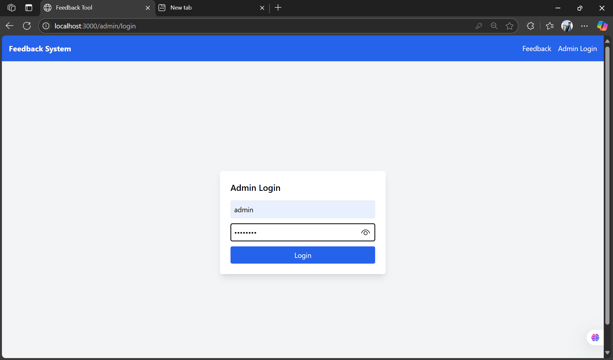
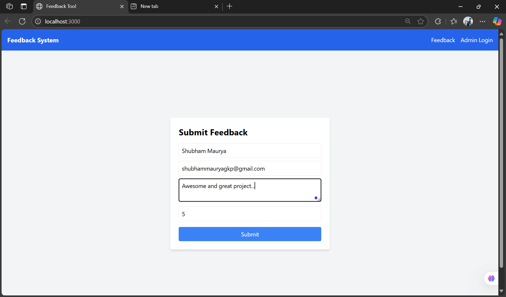
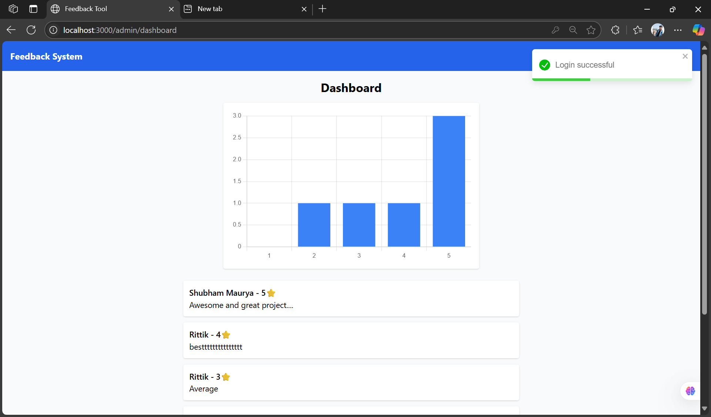
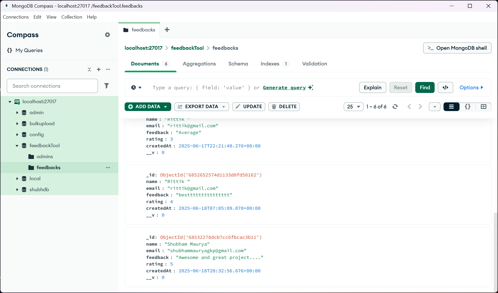

# 📊 Task 5 – Feedback Collection Tool (Shelfex Internship)

## 🧩 Problem Statement

Build a web application where users can submit feedback and ratings, and admins can log in to view a dashboard summarizing all feedback.

---

## 🚀 Features

- Feedback form for users (Name, Rating, Message)
- Admin login system (JWT authentication)
- Admin dashboard with:
  - Feedback list
  - Star ratings
  - Bar chart (rating distribution)
- Toast notifications
- Responsive UI with Tailwind CSS
- Authentication-protected routes

---

## 🛠 Tech Stack

- **Frontend:** React, Tailwind CSS, Chart.js, React Router
- **Backend:** Node.js, Express.js, MongoDB
- **Authentication:** JWT (JSON Web Tokens)
- **Charts:** Chart.js (via `react-chartjs-2`)
- **Other Tools:** Toastify, Axios, dotenv, bcrypt

---

## 📁 Folder Structure

feedback-tool-shelfex/
│
├── backend/
│ ├── routes/ # Feedback & admin routes
│ ├── models/ # Mongoose models
│ ├── middleware/ # JWT auth middleware
│ ├── server.js # Entry point
│ └── .env # Environment variables
│
├── frontend/
│ ├── src/
│ │ ├── pages/ # FeedbackForm, AdminLogin, Dashboard
│ │ ├── components/ # Reusable components (Navbar etc.)
│ │ ├── App.js
│ │ └── index.js
│ ├── tailwind.config.js
│ └── package.json
│
├── README.md
└── .gitignore

---

## ▶️ How to Run

### 🔧 Backend:
cd backend
npm install
npm start

Create a .env file in /backend:
PORT=5000
MONGO_URI=your_mongo_uri
JWT_SECRET=your_jwt_secret
💻 Frontend:
cd frontend
npm install
npm start
Make sure backend is running on port 5000 or update the API base URL in frontend accordingly.


📸 Screenshots:
### 🔐 Admin Login  


### ✍️ Feedback Form  


### 📊 Admin Dashboard  


### 🧠 MongoDB Compass View  



👨‍💻 Developed by
Shubham Maurya
[https://github.com/shubhammaurya8840]

---

## ✅ Next Steps:

1. Create a file: `README.md` inside your Task 5 repo root
2. Paste the content above
3. Save and run:
```bash
git add README.md
git commit -m "Add Task 5 README"
git push
